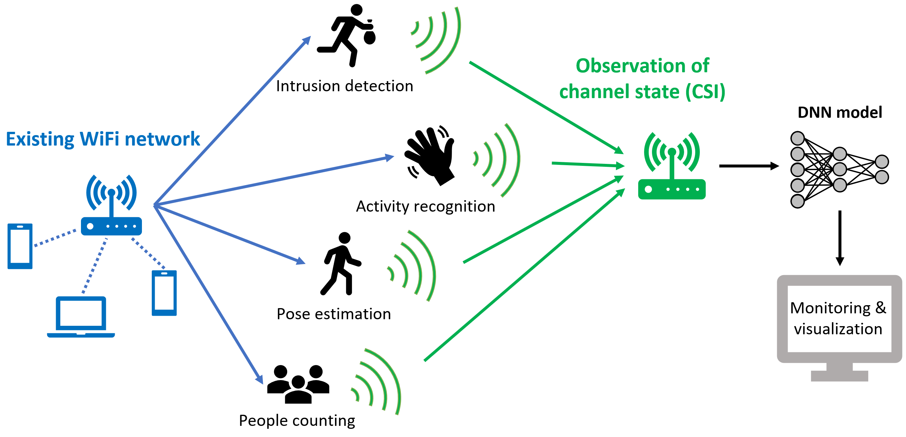
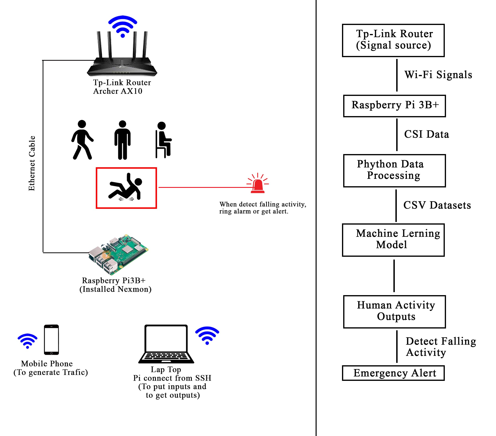
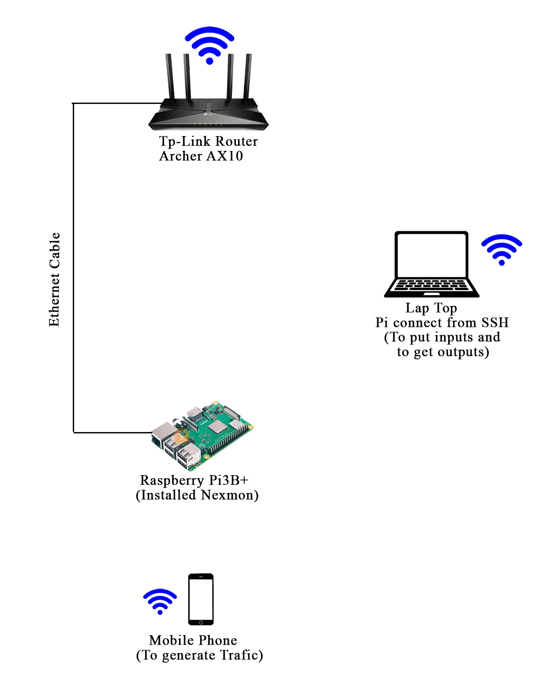
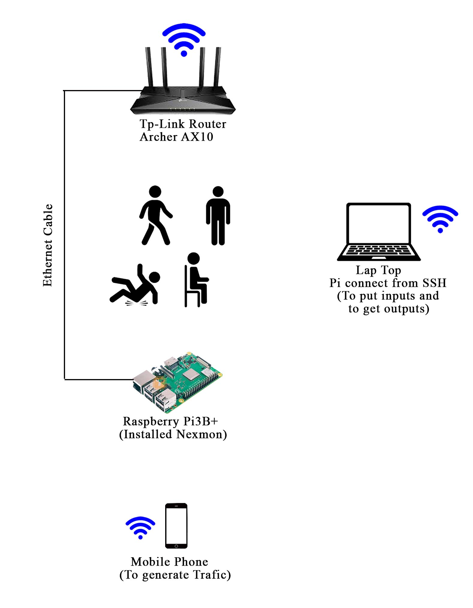

# AI-Powered Human Activity Monitoring System Using Wi-Fi CSI

<div align="center">


**A real-time, privacy-preserving human activity recognition system that uses Wi-Fi Channel State Information (CSI) and deep learning to detect human activities — without cameras or wearable sensors.**

*Final Year Project | Department of Electronic and Telecommunication Engineering | SLTC Research University, Sri Lanka*

</div>

---

##  Overview

Traditional activity monitoring systems rely on **cameras** (privacy-invasive) or **wearable sensors** (costly and uncomfortable). This project proposes a **device-free, non-intrusive** alternative using Wi-Fi signals already present in the environment.

When a person moves, they disturb Wi-Fi signals propagating through space. By analyzing these **Channel State Information (CSI)** perturbations using a **CNN-LSTM hybrid deep learning model**, the system can accurately classify human activities in real time — and trigger an **emergency alert** when a fall is detected.



---

##  Target Activities

| Activity | Description | Alert |
|----------|-------------|-------|
| 🧍 Standing | Person standing still | — |
| 🪑 Sitting | Person seated | — |
| 🚶 Walking | Person in motion | — |
| 🚨 Falling | Person has fallen | **Emergency Alert** |

---

##  System Workflow



The system follows this pipeline:

```
TP-Link Router (Signal Source)
        │
        │  Wi-Fi Signals (2.4 GHz)
        ▼
Raspberry Pi 3B+ (Nexmon CSI Tool)
        │
        │  Raw CSI Data (64 subcarriers)
        ▼
Python Data Processing
  - Noise Filtering
  - Normalization
  - Feature Extraction
        │
        │  CSV Datasets
        ▼
CNN-LSTM Machine Learning Model
        │
        ▼
Human Activity Classification
  ├── Standing / Sitting / Walking
  └── Falling → 🚨 Emergency Alert
```

---

##  Hardware Setup



| Component | Details | Role |
|-----------|---------|------|
| TP-Link Archer AX10 | Wi-Fi Router | Signal source |
| Raspberry Pi 3B+ | Nexmon CSI firmware installed | CSI data extraction |
| Laptop | SSH connection to Pi | Control & output |
| Mobile Phone | Termux + iperf3 | Traffic generation |
| Ethernet Cable | Router ↔ Pi | Wired connection |
| GSM Module | SIM-based | Emergency SMS alert |

---

##  Data Capture Setup



### How Traffic is Generated

This project uses a **software-based traffic generation** approach — no OpenWRT or router-side configuration needed.

**On Raspberry Pi** — runs as iperf3 server:
```bash
iperf3 -s
```

**On Mobile Phone (Termux)** — connected to same Wi-Fi, runs as iperf3 client:
```bash
# Install iperf3 in Termux
pkg install iperf3

# Generate continuous fixed traffic to Pi
iperf3 -c <Pi_IP_Address> -t 0 -b 10M
```

This creates a **fixed, continuous Wi-Fi traffic stream** from the phone through the router to the Pi — allowing the Nexmon CSI tool to capture stable CSI readings as people perform activities in the environment.

---

##  Repository Structure

This is the **main repository** of the project. It links four submodules, each handling a specific component.

```
wifi-csi-human-activity-monitoring-system/   ← Main Repo (You are here)
│
├──  wifi-csi-capture/                     ← Submodule 1
│   └── CSI capture scripts using Nexmon on Raspberry Pi
│
├──  wifi-csi-activity-dataset/            ← Submodule 2
│   └── Labeled CSI dataset for all target activities
│
├──  deep-learning-wifi-csi-har/           ← Submodule 3
│   └── CNN-LSTM model training & evaluation
│
├──  wifi-csi-realtime-monitoring/         ← Submodule 4
│   └── Real-time inference engine & alert system
│
├── docs/images/                             ← Project diagrams & photos
├── .gitmodules
├── LICENSE
└── README.md
```

---

## 🔗 Submodule Repositories

| Module | Description | Link |
|--------|-------------|------|
|  **wifi-csi-capture** | CSI data capture using Nexmon on Raspberry Pi 3B+ | [View Repo](https://github.com/HPusswella/wifi-csi-capture) |
|  **wifi-csi-activity-dataset** | Labeled CSI dataset — standing, sitting, walking, falling | [View Repo](https://github.com/HPusswella/wifi-csi-activity-dataset) |
|  **deep-learning-wifi-csi-har** | CNN-LSTM hybrid model for activity classification | [View Repo](https://github.com/HPusswella/deep-learning-wifi-csi-har) |
|  **wifi-csi-realtime-monitoring** | Real-time monitoring with emergency fall detection & GSM alert | [View Repo](https://github.com/HPusswella/wifi-csi-realtime-monitoring) |

---

##  Software Stack

| Tool | Purpose |
|------|---------|
| Nexmon CSI | Modified firmware for CSI extraction on Raspberry Pi |
| Python Sockets | Real-time data transmission from Pi to processing unit |
| iperf3 (Pi) | iperf3 server for receiving traffic |
| iperf3 (Termux) | Fixed traffic generation from mobile phone |
| NumPy / Pandas | Data preprocessing — filtering, normalization |
| TensorFlow / Keras | CNN-LSTM model training and inference |
| TCPDUMP / PYPCAP | Packet capture |

---

##  Getting Started

### Clone with All Submodules

```bash
git clone --recurse-submodules https://github.com/HPusswella/wifi-csi-human-activity-monitoring-system
```

If already cloned without submodules:
```bash
git submodule update --init --recursive
```

### Project Workflow

```
Step 1 → Setup Pi + Router + Termux traffic      [wifi-csi-capture]
Step 2 → Collect & label CSI data                [wifi-csi-activity-dataset]
Step 3 → Train CNN-LSTM model                    [deep-learning-wifi-csi-har]
Step 4 → Deploy real-time monitoring & alerts    [wifi-csi-realtime-monitoring]
```

> Refer to each submodule's `README.md` for detailed setup and usage instructions.

---

##  Team

| Name | Student ID | Role |
|------|-----------|------|
| P.G.R.H. Pusswella 
| D.K. Nivedya 

**Supervisor:** Ms. Dilanka De Silva  
**Co-Supervisor:** Mr. Chathuranga Basnayaka

*Department of Electronic and Telecommunication Engineering — SLTC Research University, Sri Lanka*

---

## 📄 License

This project is licensed under the [MIT License](LICENSE).

---

<div align="center">

*Made with ❤️ at SLTC Research University, Sri Lanka*

</div>
